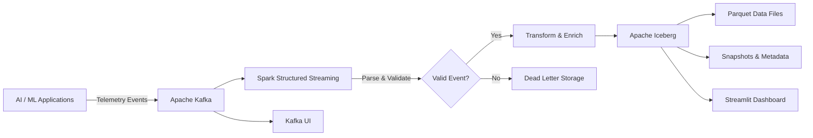

# Real-Time AI Telemetry & Data Platform

A production-oriented distributed platform for ingesting, validating, processing, storing, and visualizing **AI/ML runtime telemetry** using **Apache Kafka, Apache Spark Structured Streaming, Apache Iceberg, and Streamlit**.

The project demonstrates core **AI & Data Platform engineering** concepts including:

- event-driven ingestion
- distributed stream processing
- explicit schema validation
- checkpoint-based recovery
- malformed-event isolation
- durable lakehouse storage
- temporal partitioning
- Iceberg snapshot inspection
- AI telemetry analytics
- interactive operational visualization

---

## Architecture




### End-to-End Data Flow

```text
AI / ML Applications
        │
        ▼
Telemetry Producer
        │
        ▼
Apache Kafka
        │
        ▼
Spark Structured Streaming
        │
        ├── JSON parsing
        ├── Schema validation
        ├── Timestamp enrichment
        ├── Temporal partitioning
        │
        ├──── Invalid ─────► Dead Letter Storage
        │
        ▼
Apache Iceberg
        │
        ├── Parquet data
        ├── Snapshot metadata
        │
        ▼
Streamlit Dashboard
        │
        ├── Platform KPIs
        ├── Model latency
        ├── Token consumption
        ├── Provider distribution
        ├── Guardrail signals
        └── Recent telemetry
```

---

## Why This Project?

Modern AI applications generate continuous operational telemetry describing model behavior, application activity, performance, resource consumption, and safety signals.

Examples include:

- model latency
- prompt token usage
- completion token usage
- model and provider information
- application identifiers
- latency anomalies
- PII detection
- content-policy violations
- organizational context
- deployment region

Building a reliable platform for these signals requires more than simply writing events into files.

A platform must be able to:

- continuously ingest events
- preserve ordering where necessary
- validate incoming payloads
- isolate malformed events
- recover processing state after restarts
- organize historical data efficiently
- expose durable analytical datasets
- visualize operational behavior
- provide visibility into table and processing state

This project implements those foundations using:

```text
Kafka
  ↓
Spark Structured Streaming
  ↓
Apache Iceberg
  ↓
Streamlit
```

---

# Key Capabilities

## 1. Real-Time AI Telemetry Generation

The telemetry producer simulates runtime signals generated by AI/ML applications.

Example event:

```json
{
  "event_id": "evt_123456",
  "app_id": "search-agent-v2",
  "environment": "production",
  "timestamp": "2026-10-05T14:30:00+00:00",

  "model_metadata": {
    "model_name": "gpt-4o",
    "provider": "openai",
    "prompt_tokens": 1250,
    "completion_tokens": 320,
    "latency_ms": 245,
    "is_anomaly_simulated": false
  },

  "guardrail_flags": {
    "pii_detected": false,
    "content_policy_violated": false
  },

  "user_context": {
    "org_unit": "search-relevance",
    "region": "us-east-1"
  }
}
```

The producer simulates telemetry across multiple AI applications and model providers.

It also generates occasional:

- latency anomalies
- PII detection events
- content-policy violations

This creates realistic operational signals for exercising the streaming platform.

---

## 2. Kafka-Based Event Ingestion

Telemetry events are published to:

```text
ai_telemetry_events
```

The producer uses `app_id` as the Kafka message key.

```text
app_id
   │
   ▼
Kafka Partition
```

This helps preserve ordering for events belonging to the same application.

### Producer Reliability

The producer is configured with:

```text
acks = all
retries = 5
max_in_flight_requests_per_connection = 1
```

These settings provide stronger delivery behavior and preserve ordering across retries.

The local producer generates approximately:

```text
~5 events / second
```

for development and testing.

---

## 3. Spark Structured Streaming

Apache Spark Structured Streaming continuously consumes telemetry from Kafka.

The processing pipeline performs:

```text
Kafka Event
    │
    ▼
JSON Parsing
    │
    ▼
Explicit Schema
    │
    ▼
Validation
    │
    ▼
Timestamp Conversion
    │
    ▼
Ingestion Timestamp
    │
    ▼
Temporal Partition Derivation
    │
    ▼
Apache Iceberg
```

The main ingestion stream uses a:

```text
5-second processing trigger
```

while malformed-event storage uses an independent streaming query and checkpoint.

---

## 4. Explicit Telemetry Schema

Incoming JSON is parsed using an explicit Spark schema.

```text
event_id
app_id
environment
timestamp

model_metadata
├── model_name
├── provider
├── prompt_tokens
├── completion_tokens
├── latency_ms
└── is_anomaly_simulated

guardrail_flags
├── pii_detected
└── content_policy_violated

user_context
├── org_unit
└── region
```

Explicit schema parsing provides predictable downstream processing and allows invalid records to be separated from valid telemetry.

---

## 5. Malformed Event Isolation

Events that fail validation are isolated from the primary ingestion path.

```text
                   Spark
                     │
                 Validation
                  /      \
                 /        \
              Valid      Invalid
                │           │
                ▼           ▼
             Iceberg       DLQ
```

A record is currently treated as malformed when parsing does not produce a valid `event_id`.

Malformed records are written to dedicated JSON storage instead of contaminating the primary Iceberg dataset.

Current dead-letter storage:

```text
spark-warehouse/iceberg/dlq/malformed_events
```

---

## 6. Independent Streaming Checkpoints

The platform maintains separate checkpoints for:

```text
telemetry_ingest
dlq_ingest
```

Default checkpoint root:

```text
spark-warehouse/checkpoints
```

This allows the primary telemetry pipeline and malformed-event pipeline to maintain independent streaming progress.

Checkpointing provides the foundation for recovering processing state after application restarts.

---

## 7. Apache Iceberg Lakehouse Storage

Valid telemetry is written to:

```text
local.db.ai_telemetry_events
```

using an Apache Iceberg Hadoop-backed catalog.

The table contains the original telemetry together with additional operational metadata:

```text
event_timestamp
ingested_at
year
month
day
hour
```

This separates the original event time from the time at which the platform processed the event.

---

## 8. Temporal Partitioning

The streaming pipeline derives temporal fields from the event timestamp:

```text
event_timestamp
      │
      ├── year
      ├── month
      ├── day
      └── hour
```

The Iceberg table currently uses:

```sql
PARTITIONED BY (
    year,
    month,
    day,
    hour
)
```

This organizes telemetry by event time and supports efficient time-bounded analytical queries.

---

## 9. Iceberg Snapshot Inspection

Apache Iceberg maintains metadata describing committed table states.

The repository includes a verification utility that queries snapshot metadata:

```sql
SELECT
    snapshot_id,
    committed_at,
    operation
FROM local.db.ai_telemetry_events.snapshots;
```

This provides visibility into Iceberg table commits and allows the platform to inspect how the analytical dataset evolves.

---

## 10. Kafka UI

The local development environment includes **Kafka UI** for inspecting Kafka topics and messages.

After starting Docker Compose:

```text
http://localhost:8080
```

Navigate to:

```text
Topics
   ↓
ai_telemetry_events
   ↓
Messages
```

Kafka UI provides visibility into the ingestion layer before events reach Spark.

---

## 11. AI Telemetry Dashboard

The platform includes a **Streamlit dashboard** that queries the Iceberg telemetry table.

```text
Apache Iceberg
      │
      ▼
Spark SQL
      │
      ▼
Pandas
      │
      ▼
Streamlit
```

The dashboard provides visibility into:

### Platform KPIs

- total telemetry events
- average model latency
- anomaly rate
- PII detections
- content-policy violations

### Model Analytics

- events by model
- average latency by model
- events by provider
- prompt token consumption
- completion token consumption

### Application Analytics

- events by application

### Operational Inspection

- latest telemetry events
- Iceberg snapshot history

The dashboard runs locally at:

```text
http://localhost:8501
```

---

# Repository Structure

```text
realtime-lakehouse-telemetry/
│
├── config/
│   ├── __init__.py
│   ├── kafka_config.py
│   └── spark_config.py
│
├── src/
│   ├── __init__.py
│   ├── producer.py
│   ├── consumer_lakehouse.py
│   ├── verify_iceberg.py
│   └── dashboard.py
│
├── tests/
│   └── __init__.py
│
├── docker-compose.yml
├── requirements.txt
└── README.md
```

### Component Responsibilities

| Component               | Responsibility                                                                |
| ----------------------- | ----------------------------------------------------------------------------- |
| `producer.py`           | Generates synthetic AI/ML telemetry and publishes events to Kafka             |
| `consumer_lakehouse.py` | Processes Kafka events using Spark Structured Streaming and writes to Iceberg |
| `verify_iceberg.py`     | Queries recent telemetry and Iceberg snapshot metadata                        |
| `dashboard.py`          | Provides an interactive Streamlit telemetry dashboard                         |
| `kafka_config.py`       | Kafka connection, topic, and producer configuration                           |
| `spark_config.py`       | Spark, Kafka connector, and Iceberg catalog configuration                     |
| `docker-compose.yml`    | Kafka, ZooKeeper, and Kafka UI infrastructure                                 |

---

# Technology Stack

| Layer                     | Technology                    |
| ------------------------- | ----------------------------- |
| Event Streaming           | Apache Kafka                  |
| Distributed Processing    | Apache Spark                  |
| Stream Processing         | Spark Structured Streaming    |
| Processing API            | PySpark                       |
| Lakehouse Table Format    | Apache Iceberg                |
| Storage Format            | Apache Parquet                |
| Catalog                   | Hadoop-backed Iceberg Catalog |
| Dashboard                 | Streamlit                     |
| Dashboard Data Processing | Pandas / Spark SQL            |
| Language                  | Python                        |
| Infrastructure            | Docker Compose                |
| Kafka Inspection          | Kafka UI                      |

---

# Local Development Environment

Recommended development environment:

```text
Python 3.11
Java 17
PySpark 3.5.1
Apache Iceberg 1.5.0
Apache Kafka
Streamlit
Docker / Docker Compose
```

---

# Getting Started

## Prerequisites

Install:

- Python 3.11
- Java 17
- Docker
- Docker Compose

Verify:

```bash
python3.11 --version
java -version
docker --version
docker compose version
```

---

## 1. Clone the Repository

```bash
git clone https://github.com/ashokraminedi/realtime-lakehouse-telemetry.git

cd realtime-lakehouse-telemetry
```

---

## 2. Create the Python Environment

```bash
python3.11 -m venv venv

source venv/bin/activate
```

Upgrade pip:

```bash
python -m pip install --upgrade pip
```

Install dependencies:

```bash
pip install -r requirements.txt
```

Verify the active Python:

```bash
python --version
which python
```

---

# Running the Platform End-to-End

The complete platform can be run locally using four terminals.

```text
Terminal 1 → Infrastructure
Terminal 2 → Spark Streaming Consumer
Terminal 3 → Telemetry Producer
Terminal 4 → Streamlit Dashboard
```

---

## Terminal 1 — Start Infrastructure

```bash
cd /Users/rashmiashok/projects/realtime-lakehouse-telemetry

docker compose up -d
```

Verify:

```bash
docker compose ps
```

The following services should be running:

```text
zookeeper
kafka
kafka-ui
```

Kafka:

```text
localhost:9092
```

Kafka UI:

```text
http://localhost:8080
```

---

## Terminal 2 — Start the Streaming Consumer

```bash
cd /Users/rashmiashok/projects/realtime-lakehouse-telemetry

source venv/bin/activate

python -m src.consumer_lakehouse
```

The consumer:

1. initializes Spark
2. configures Iceberg
3. creates the target table if necessary
4. subscribes to Kafka
5. parses incoming telemetry
6. validates events
7. routes malformed events
8. enriches valid events
9. writes valid telemetry to Iceberg

```text
Kafka
  │
  ▼
Spark Structured Streaming
  │
  ├── Invalid ─────► Dead Letter Storage
  │
  ▼
Iceberg
```

---

## Terminal 3 — Start the Telemetry Producer

```bash
cd /Users/rashmiashok/projects/realtime-lakehouse-telemetry

source venv/bin/activate

python -m src.producer
```

Example output:

```text
[+] Streamed 10 events
[+] Streamed 20 events
[+] Streamed 30 events
```

The producer continues generating telemetry until stopped with:

```text
Ctrl+C
```

---

## Terminal 4 — Start the Streamlit Dashboard

```bash
cd /Users/rashmiashok/projects/realtime-lakehouse-telemetry

source venv/bin/activate

PYTHONPATH=. python -m streamlit run src/dashboard.py
```

Open:

```text
http://localhost:8501
```

The dashboard reads the current Iceberg table and displays AI telemetry metrics and analytical views.

Use **Refresh telemetry** to query the latest committed Iceberg data.

---

# Verify Kafka

Open:

```text
http://localhost:8080
```

Navigate to:

```text
Topics
   ↓
ai_telemetry_events
   ↓
Messages
```

You should see generated telemetry events.

This validates:

```text
Producer
   ↓
Kafka
   ✓
```

---

# Verify Iceberg

From another terminal:

```bash
cd /Users/rashmiashok/projects/realtime-lakehouse-telemetry

source venv/bin/activate

python -m src.verify_iceberg
```

The verification utility queries recent telemetry:

```sql
SELECT *
FROM local.db.ai_telemetry_events
ORDER BY timestamp DESC
LIMIT 10;
```

It also queries Iceberg snapshot metadata:

```sql
SELECT
    snapshot_id,
    committed_at,
    operation
FROM local.db.ai_telemetry_events.snapshots;
```

Successful output verifies:

```text
Producer
   ↓
Kafka
   ↓
Spark
   ↓
Iceberg
   ↓
Query
   ✓
```

---

# Complete Local Architecture

```text
                        ┌─────────────────────┐
                        │ Telemetry Producer  │
                        └──────────┬──────────┘
                                   │
                                   ▼
                        ┌─────────────────────┐
                        │    Apache Kafka     │◄──── Kafka UI :8080
                        └──────────┬──────────┘
                                   │
                                   ▼
                    ┌─────────────────────────────┐
                    │ Spark Structured Streaming  │
                    └──────────────┬──────────────┘
                                   │
                         ┌─────────┴─────────┐
                         │                   │
                      Valid              Malformed
                         │                   │
                         ▼                   ▼
                ┌────────────────┐    ┌───────────────┐
                │ Apache Iceberg │    │ Dead Letter   │
                │                │    │ JSON Storage  │
                └───────┬────────┘    └───────────────┘
                        │
             ┌──────────┴───────────┐
             │                      │
             ▼                      ▼
      verify_iceberg.py       Streamlit Dashboard
                                  :8501
```

---

# Local Storage

The default Iceberg warehouse is:

```text
spark-warehouse/iceberg
```

The default streaming checkpoint location is:

```text
spark-warehouse/checkpoints
```

Inspect the local platform state:

```bash
find spark-warehouse -maxdepth 4 -type d | sort
```

---

# Testing the Dead Letter Path

Malformed records can be injected manually into Kafka.

Start a Kafka console producer:

```bash
docker exec -it kafka kafka-console-producer \
  --bootstrap-server localhost:9092 \
  --topic ai_telemetry_events
```

Enter:

```text
this-is-not-valid-json
```

The malformed event should be routed to:

```text
spark-warehouse/iceberg/dlq/malformed_events
```

instead of the primary Iceberg table.

```text
                 Spark
                /     \
               /       \
           Valid       Invalid
             │            │
             ▼            ▼
          Iceberg         DLQ
             ✓             ✓
```

---

# Testing Checkpoint Recovery

Checkpoint recovery can be tested by temporarily stopping the Spark consumer while leaving the producer and Kafka running.

### 1. Start normal processing

```text
Producer → Kafka → Spark → Iceberg
```

### 2. Stop the Spark consumer

```text
Ctrl+C
```

Leave the producer running.

Kafka continues receiving events while Spark is unavailable.

### 3. Restart the consumer

```bash
python -m src.consumer_lakehouse
```

The streaming application resumes using its existing checkpoint state.

This exercise demonstrates the relationship between:

- durable Kafka events
- Spark streaming state
- checkpoint-based recovery
- Iceberg commits

---

# Reliability Model

The current implementation uses multiple layers of reliability.

```text
AI Application
      │
      ▼
Kafka Producer
      │
      ├── acknowledgements
      ├── retries
      └── keyed events
      │
      ▼
Apache Kafka
      │
      ▼
Spark Structured Streaming
      │
      ├── explicit schema
      ├── validation
      ├── checkpointing
      └── failure isolation
      │
      ▼
Apache Iceberg
      │
      ├── durable table state
      └── snapshot metadata
      │
      ▼
Streamlit
      │
      └── operational visualization
```

The architecture separates ingestion, processing, failure handling, storage, and visualization into distinct responsibilities.

---

# Configuration

## Kafka

Defaults:

```text
KAFKA_BOOTSTRAP_SERVERS=localhost:9092
TELEMETRY_TOPIC=ai_telemetry_events
DLQ_TOPIC=ai_telemetry_dlq
```

Kafka configuration can be overridden using environment variables.

Example:

```bash
export KAFKA_BOOTSTRAP_SERVERS=localhost:9092
export TELEMETRY_TOPIC=ai_telemetry_events
```

> `DLQ_TOPIC` is currently defined in configuration for future evolution. The current malformed-event pipeline writes JSON records to dead-letter filesystem storage rather than publishing them to the Kafka DLQ topic.

---

## Spark / Iceberg

Defaults:

```text
WAREHOUSE_PATH=spark-warehouse/iceberg
CHECKPOINT_PATH=spark-warehouse/checkpoints
```

Override if necessary:

```bash
export WAREHOUSE_PATH=spark-warehouse/iceberg
export CHECKPOINT_PATH=spark-warehouse/checkpoints
```

---

# Current Platform Capabilities

The current implementation demonstrates:

- synthetic AI/ML telemetry generation
- event-driven architecture
- Kafka-based ingestion
- keyed Kafka events
- producer acknowledgements and retries
- Spark Structured Streaming
- explicit schema parsing
- malformed-event isolation
- dead-letter filesystem storage
- independent streaming checkpoints
- checkpoint-based restart recovery
- event timestamp conversion
- ingestion timestamp enrichment
- temporal partition derivation
- Apache Iceberg storage
- Iceberg snapshot inspection
- Kafka topic/message inspection
- AI telemetry KPI visualization
- model-level latency analytics
- provider distribution analytics
- token-consumption analytics
- guardrail signal visualization
- recent telemetry inspection
- graceful producer shutdown
- graceful streaming shutdown

---

# Production Evolution

The following capabilities are planned extensions rather than features currently implemented.

---

## 1. Automated Testing

Expand the test suite with:

```text
tests/
├── test_producer.py
├── test_validation.py
├── test_streaming.py
├── test_dlq.py
├── test_checkpoint_recovery.py
└── test_replay.py
```

Important scenarios:

- valid event processing
- malformed JSON
- missing `event_id`
- producer serialization
- Kafka → Iceberg processing
- consumer restart
- checkpoint recovery
- duplicate event handling
- DLQ replay

---

## 2. DLQ Replay

Extend malformed-event handling into a complete recovery workflow.

```text
Malformed Event
      │
      ▼
     DLQ
      │
      ▼
Investigation / Correction
      │
      ▼
Replay Service
      │
      ▼
Validation
      │
      ▼
Processing Pipeline
```

The replay mechanism should include:

- validation
- retry limits
- replay status
- duplicate protection
- idempotency
- replay failure handling

---

## 3. Idempotent Processing

Introduce event-level duplicate protection using `event_id`.

Potential design:

```text
Kafka Event
     │
     ▼
event_id
     │
     ▼
Duplicate Check
   /       \
 New      Existing
  │          │
  ▼          ▼
Process     Skip
```

This becomes especially important once DLQ replay and recovery scenarios are introduced.

---

## 4. Platform Observability

Expose operational metrics such as:

```text
telemetry_events_received_total
telemetry_events_processed_total
telemetry_events_failed_total

dlq_events_total

Kafka consumer lag
stream batch duration
processing latency
Iceberg commit latency
```

Future monitoring architecture:

```text
Kafka / Spark / Platform Services
             │
             ▼
          Metrics
             │
             ▼
        Prometheus
             │
             ▼
          Grafana
```

This complements the existing Streamlit analytics dashboard.

Streamlit answers questions about **AI telemetry data**.

Prometheus/Grafana would answer questions about **platform health**.

---

## 5. Streaming Semantics

Extend the pipeline with:

- event-time watermarking
- late-event handling
- out-of-order event handling
- stronger delivery guarantees
- replay-safe processing
- duplicate detection

---

## 6. Load and Failure Testing

Exercise the platform under controlled failures.

Examples:

```text
Increase producer throughput
        │
        ▼
Observe Kafka backlog
        │
        ▼
Measure Spark processing
        │
        ▼
Observe recovery
```

Failure scenarios:

- stop the Spark consumer
- restart the consumer
- inject malformed records
- increase producer event rate
- simulate processing delays
- replay failed events

Measure:

- throughput
- processing latency
- Kafka lag
- recovery time
- duplicate behavior
- DLQ volume

---

## 7. Iceberg Lifecycle Management

Add automated Iceberg maintenance including:

- small-file compaction
- snapshot expiration
- retention policies
- schema-evolution demonstrations
- partition evolution experiments

---

## 8. Kubernetes Deployment

A future deployment model can move the compute and supporting services onto Kubernetes.

```text
                       Managed Kafka
                            │
                            ▼
                 ┌── Kubernetes ────────┐
                 │                      │
                 │ Spark Driver         │
                 │      │               │
                 │      ├── Executor    │
                 │      ├── Executor    │
                 │      └── Executor    │
                 │                      │
                 │ DLQ Replay Service   │
                 │                      │
                 │ Telemetry API        │
                 │                      │
                 │ Metrics Exporter     │
                 └──────────┬───────────┘
                            │
                            ▼
                      Apache Iceberg
                            │
                            ▼
                      Object Storage
```

Kubernetes would provide:

- workload orchestration
- container lifecycle management
- resource requests and limits
- configuration management
- service discovery
- restart behavior
- deployment automation
- scalable compute

For a Kubernetes deployment, the current local checkpoint and Iceberg storage would need to move to durable shared/object storage.

---

# Production Deployment Direction

| Local Implementation     | Production Direction                       |
| ------------------------ | ------------------------------------------ |
| Local Kafka              | Managed Kafka / Confluent / Amazon MSK     |
| Local Spark              | Spark on Kubernetes / Dataproc / EMR       |
| Local filesystem         | S3 / GCS / ADLS                            |
| Hadoop Iceberg Catalog   | REST / Glue / Hive Catalog                 |
| Local checkpoints        | Durable object storage                     |
| JSON dead-letter storage | Durable DLQ + replay service               |
| Kafka UI                 | Centralized platform observability         |
| Streamlit                | Internal telemetry analytics / platform UI |
| Manual execution         | Kubernetes / workflow orchestration        |

---

# Engineering Concepts Demonstrated

## Event-Driven Architecture

Kafka decouples telemetry producers from downstream processing.

## Distributed Stream Processing

Spark Structured Streaming continuously processes incoming AI telemetry.

## Failure Recovery

Streaming checkpoints preserve processing progress across application restarts.

## Failure Isolation

Malformed records are separated from the primary analytical dataset.

## Lakehouse Architecture

Apache Iceberg provides a structured analytical table abstraction over Parquet data files.

## Temporal Data Organization

Telemetry is organized using event-time-derived year, month, day, and hour dimensions.

## Operational Metadata

Iceberg snapshots expose historical table commit state.

## AI Platform Telemetry

The event model captures:

- model identity
- model provider
- model latency
- prompt tokens
- completion tokens
- anomalies
- PII signals
- content-policy signals
- application context

## Analytics & Visualization

Streamlit converts persisted telemetry into an interactive view of AI application behavior.

## Separation of Concerns

The platform maintains clear boundaries between:

```text
Event Generation
      ↓
Event Transport
      ↓
Distributed Processing
      ↓
Validation
      ↓
Failure Isolation
      ↓
Durable Storage
      ↓
Analytics & Visualization
```

---

# Roadmap

```text
Current Platform
      │
      ├── Kafka ingestion              ✓
      ├── Spark streaming              ✓
      ├── Explicit schema              ✓
      ├── Validation                   ✓
      ├── DLQ isolation                ✓
      ├── Streaming checkpoints        ✓
      ├── Iceberg storage              ✓
      ├── Snapshot inspection          ✓
      ├── Kafka UI                     ✓
      └── Streamlit dashboard          ✓
      │
      ▼
Software Reliability
      │
      ├── Automated tests
      ├── DLQ replay
      ├── Idempotency
      └── Failure testing
      │
      ▼
Platform Observability
      │
      ├── Processing metrics
      ├── Kafka lag
      ├── Prometheus
      ├── Grafana
      └── Alerting
      │
      ▼
Streaming & Scale
      │
      ├── Late-event handling
      ├── Watermarking
      ├── Load testing
      └── Backpressure analysis
      │
      ▼
Lakehouse Operations
      │
      ├── Compaction
      ├── Snapshot expiration
      ├── Schema evolution
      └── Retention policies
      │
      ▼
Cloud-Native Platform
      │
      ├── Dockerized services
      ├── Kubernetes
      ├── Spark on Kubernetes
      ├── Durable checkpoints
      └── Cloud object storage
```

---

# Project Goal

The goal of this project is to explore how a modern **AI & Data Platform** can reliably ingest, process, store, and analyze operational telemetry while maintaining clear architectural boundaries between:

```text
Ingestion
    ↓
Distributed Processing
    ↓
Validation & Failure Isolation
    ↓
Reliable Storage
    ↓
Analytics & Visualization
    ↓
Platform Observability
    ↓
AI Platform Consumers
```

The project is intentionally evolving from a local distributed implementation toward a **reliable, observable, scalable, and cloud-native AI data platform**.
