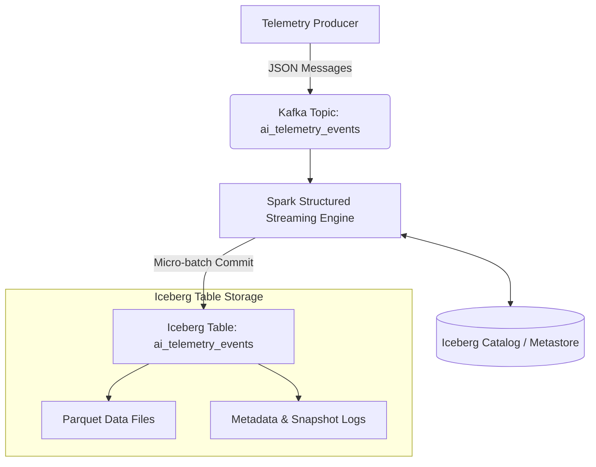

# Real-Time AI Telemetry Lakehouse Engine ⚡🧊

A high-throughput, low-latency telemetry ingestion pipeline that ingests continuous AI/ML runtime events from **Apache Kafka** and streams them into **Apache Iceberg** table format using **Spark Structured Streaming**.

Designed for reliability, time-travel querying, schema evolution, and automated small-file compaction in enterprise-grade analytics platforms.

---

## Architecture Overview

---

## Key Features

- **ACID Ingestion at Scale**: Micro-batch streaming directly into Iceberg table format with atomic commits and exactly-once processing guarantees.
- **Hidden Partitioning**: Optimized layout strategy on `hours(timestamp)` to eliminate partition management overhead while boosting query pruning performance.
- **Schema Evolution**: Native support for additive, structural, and field-rename schema changes without full-table rewrites or downstream pipeline breaks.
- **Time Travel & Snapshot Isolation**: Concurrent streaming writes and analytical reads with complete commit metadata visibility.
- **Automated Maintenance**: Pre-configured table maintenance workflows utilizing Iceberg's `rewriteDataFiles` for small-file compaction and `expireSnapshots` for storage optimization.

---

## Repository Structure

realtime-lakehouse-telemetry/
├── config/
│ └── spark_config.py # SparkSession factory with Iceberg Spark extensions
├── src/
│ ├── producer.py # Kafka event producer generating synthetic AI telemetry
│ ├── streaming_sink.py # Spark Structured Streaming pipeline to Iceberg
│ ├── compaction.py # Iceberg table compaction & snapshot expiration
│ └── verify_iceberg.py # SQL query verification & metadata inspection script
├── requirements.txt # Dependencies (pyspark, kafka-python, etc.)
└── README.md

---

## Quickstart Guide

### 1. Environment Setup

Ensure Python 3.10+, Java 8/11/17, and a running Apache Kafka broker (`localhost:9092`) are available.

# Clone the repository

git clone https://github.com/your-username/realtime-lakehouse-telemetry.git
cd realtime-lakehouse-telemetry

# Create and activate virtual environment

python3 -m venv venv
source venv/bin/activate

# Install dependencies

pip install -r requirements.txt

### 2. Start Streaming Ingestion Engine

Launch the Spark Structured Streaming sink to set up the catalog and consume incoming Kafka messages:

python -m src.streaming_sink

### 3. Generate Telemetry Load

In a separate terminal, trigger the telemetry producer to send micro-batches to Kafka:

python -m src.producer

---

## Verification & Metadata Inspection

Query table records and inspect commit snapshots:

python -c '
from config.spark_config import get_spark_session

spark = get_spark_session("Iceberg-Verification")

print("\n--- Recent Telemetry Events ---")
spark.sql("SELECT \* FROM local.db.ai_telemetry_events ORDER BY timestamp DESC LIMIT 10").show(truncate=False)

print("\n--- Iceberg Snapshots Metadata ---")
spark.sql("SELECT snapshot_id, committed_at, operation FROM local.db.ai_telemetry_events.snapshots").show(truncate=False)
'

---

## Table Maintenance & Performance Tuning

To optimize small files generated by continuous micro-batch streaming, run table compaction procedures periodically:

# Execute Iceberg layout compaction

spark.sql("""
CALL local.system.rewrite_data_files(
table => 'local.db.ai_telemetry_events',
strategy => 'sort',
sort_order => 'timestamp ASC'
)
""")

---

## Technology Stack

- **Engine**: Apache Spark 3.5.x (PySpark)
- **Table Format**: Apache Iceberg 1.5.0
- **Message Broker**: Apache Kafka 0.10+
- **Storage Format**: Apache Parquet
- **Catalog Strategy**: Hadoop / In-Memory Local Metastore
