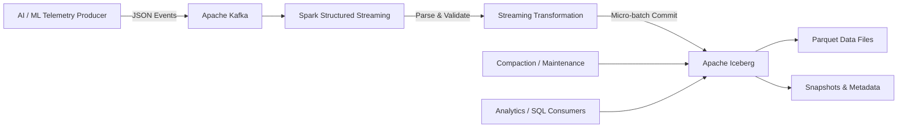

# Real-Time AI Telemetry Lakehouse

A production-oriented streaming data platform for ingesting high-volume AI/ML runtime telemetry from **Apache Kafka**, processing it with **Apache Spark Structured Streaming**, and persisting it into **Apache Iceberg** for reliable analytics.

The project demonstrates core data-platform concerns such as **streaming ingestion, ACID commits, schema evolution, time travel, partition pruning, checkpoint-based recovery, and small-file compaction**.

## Architecture



### Data Flow

```text
Telemetry Producer
        │
        ▼
     Kafka
        │
        ▼
Spark Structured Streaming
        │
        ├── Parse telemetry events
        ├── Apply schema
        ├── Process micro-batches
        └── Maintain streaming checkpoints
        │
        ▼
Apache Iceberg
        │
        ├── Parquet data files
        ├── Snapshot metadata
        ├── Schema evolution
        └── Time-travel history
        │
        ▼
Analytics / SQL Consumers
```

---

## Why This Project?

Real-time telemetry pipelines have requirements beyond simply moving events from a message broker into storage.

Production systems must handle:

| Challenge                   | Design                                    |
| --------------------------- | ----------------------------------------- |
| Continuous event ingestion  | Kafka + Spark Structured Streaming        |
| Reliable streaming recovery | Spark checkpointing                       |
| Consistent table updates    | Iceberg atomic snapshot commits           |
| Schema changes              | Iceberg schema evolution                  |
| Growing historical data     | Partitioned Parquet storage               |
| Concurrent reads and writes | Iceberg snapshot isolation                |
| Streaming small-file growth | Automated data-file compaction            |
| Historical debugging        | Iceberg time travel and snapshot metadata |

The goal of this project is to demonstrate how these concerns can be handled using an open lakehouse architecture.

---

## Key Features

### Real-Time Kafka Ingestion

Synthetic AI/ML telemetry events are continuously published to Kafka and consumed using Spark Structured Streaming.

The architecture separates event generation from downstream processing, allowing producers and consumers to scale independently.

### Reliable Streaming Processing

Spark Structured Streaming provides micro-batch execution and checkpoint-based recovery.

This allows the pipeline to recover processing state after failures without restarting ingestion from the beginning.

### ACID Lakehouse Storage

Events are persisted into Apache Iceberg tables instead of directly managing raw Parquet files.

Iceberg provides:

- atomic table commits
- snapshot isolation
- metadata-driven table state
- concurrent read/write support
- schema evolution
- time-travel queries

### Hidden Partitioning

The telemetry table uses Iceberg partition transforms based on event time:

```text
hours(timestamp)
```

Consumers query logical columns such as `timestamp` without needing to understand the physical partition layout.

This improves partition pruning while avoiding manually managed partition columns.

### Schema Evolution

Telemetry schemas evolve as services and ML systems introduce new attributes.

Iceberg allows compatible schema changes without requiring full-table rewrites.

Typical changes include:

```text
ADD COLUMN
RENAME COLUMN
ALTER COLUMN
```

### Time Travel & Snapshot Inspection

Every successful Iceberg commit produces a new table snapshot.

Snapshots make it possible to inspect historical table state and understand how data changed over time.

Example:

```sql
SELECT
    snapshot_id,
    committed_at,
    operation
FROM local.db.ai_telemetry_events.snapshots
ORDER BY committed_at DESC;
```

### Small-File Compaction

Frequent streaming micro-batches can generate many small Parquet files.

The project includes a maintenance workflow using Iceberg's `rewrite_data_files` procedure to consolidate them into larger files.

```sql
CALL local.system.rewrite_data_files(
    table => 'local.db.ai_telemetry_events',
    strategy => 'sort',
    sort_order => 'timestamp ASC'
);
```

Snapshot expiration can also be used to control metadata and storage growth over time.

---

## Repository Structure

```text
realtime-lakehouse-telemetry/
│
├── config/
│   └── spark_config.py
│       # SparkSession configuration and Iceberg extensions
│
├── src/
│   ├── producer.py
│   │   # Generates synthetic AI telemetry and publishes to Kafka
│   │
│   ├── streaming_sink.py
│   │   # Kafka → Spark Structured Streaming → Iceberg pipeline
│   │
│   ├── compaction.py
│   │   # Iceberg data-file compaction and snapshot maintenance
│   │
│   └── verify_iceberg.py
│       # Queries records and inspects Iceberg metadata
│
├── tests/
│   # Pipeline and component tests
│
├── docker-compose.yml
│   # Local infrastructure
│
├── requirements.txt
└── README.md
```

---

## Technology Stack

| Layer                  | Technology                        |
| ---------------------- | --------------------------------- |
| Event Streaming        | Apache Kafka                      |
| Stream Processing      | Apache Spark Structured Streaming |
| Processing API         | PySpark                           |
| Lakehouse Table Format | Apache Iceberg                    |
| Storage Format         | Apache Parquet                    |
| Catalog                | Hadoop / Local Catalog            |
| Language               | Python                            |
| Local Infrastructure   | Docker Compose                    |

---

## Quick Start

### Prerequisites

Ensure the following are installed:

- Python 3.10+
- Java 11 or 17
- Docker / Docker Compose

### 1. Clone the Repository

```bash
git clone https://github.com/ashokraminedi/realtime-lakehouse-telemetry.git
cd realtime-lakehouse-telemetry
```

### 2. Create a Python Environment

```bash
python3 -m venv venv
source venv/bin/activate
```

On Windows:

```bash
venv\Scripts\activate
```

Install dependencies:

```bash
pip install -r requirements.txt
```

### 3. Start Local Infrastructure

```bash
docker compose up -d
```

Verify the containers are running:

```bash
docker compose ps
```

### 4. Start the Streaming Pipeline

Start the Spark Structured Streaming consumer:

```bash
python -m src.streaming_sink
```

The streaming job consumes telemetry events from Kafka and commits each processed micro-batch into the Iceberg table.

### 5. Generate Telemetry

In another terminal:

```bash
python -m src.producer
```

The producer generates synthetic AI/ML runtime telemetry and publishes the events to Kafka.

---

## Verify the Pipeline

Run:

```bash
python -m src.verify_iceberg
```

Or query the table directly through Spark SQL:

```python
from config.spark_config import get_spark_session

spark = get_spark_session("Iceberg-Verification")

spark.sql("""
    SELECT *
    FROM local.db.ai_telemetry_events
    ORDER BY timestamp DESC
    LIMIT 10
""").show(truncate=False)
```

Inspect Iceberg snapshot history:

```python
spark.sql("""
    SELECT
        snapshot_id,
        committed_at,
        operation
    FROM local.db.ai_telemetry_events.snapshots
    ORDER BY committed_at DESC
""").show(truncate=False)
```

---

## Table Maintenance

Continuous streaming workloads can create many small data files.

Run the maintenance job:

```bash
python -m src.compaction
```

The maintenance workflow is responsible for operations such as:

```text
rewrite_data_files
        │
        └── Combine small Parquet files

expire_snapshots
        │
        └── Remove obsolete snapshot metadata
```

In a production environment these operations would typically run periodically through an orchestrator such as Airflow or a scheduled Spark job.

---

## Reliability Model

The pipeline uses multiple layers of reliability:

```text
Kafka offsets
     │
     ▼
Spark Structured Streaming checkpoint
     │
     ▼
Micro-batch execution
     │
     ▼
Iceberg atomic snapshot commit
     │
     ▼
Durable table state
```

A production deployment would additionally consider:

- durable checkpoint storage
- Kafka replication and retention
- malformed-event handling / dead-letter queues
- retry policies
- streaming lag monitoring
- data-quality validation
- schema compatibility controls
- compaction scheduling
- snapshot-retention policies

---

## Production Scaling Path

The local implementation intentionally keeps infrastructure lightweight while preserving the same architectural boundaries used by larger deployments.

| Local Implementation  | Production Equivalent                |
| --------------------- | ------------------------------------ |
| Local Kafka           | Managed Kafka / Confluent / MSK      |
| Local Spark           | Dataproc / EMR / Kubernetes Spark    |
| Local Iceberg catalog | REST / Hive / Glue catalog           |
| Local filesystem      | S3 / GCS / ADLS                      |
| Local checkpoint      | Durable object storage               |
| Manual maintenance    | Airflow / scheduled Spark jobs       |
| Local monitoring      | Prometheus / Grafana / OpenTelemetry |

This separation allows the ingestion, processing, storage, and maintenance layers to evolve independently.

---

## Design Principles

The project emphasizes several production data-platform principles:

**Idempotent processing**  
Retries should not create inconsistent table state.

**Failure recovery**  
Streaming progress should survive process and infrastructure failures.

**Storage/compute separation**  
Streaming processing remains independent from the durable lakehouse representation.

**Schema evolution**  
Telemetry producers can evolve without requiring complete historical rewrites.

**Observability**  
Streaming lag, throughput, failures, commit latency, and table health should be measurable.

**Maintainability**  
Compaction and snapshot retention are treated as first-class lifecycle operations rather than afterthoughts.

---

## Future Improvements

Potential extensions include:

- dead-letter queue for malformed telemetry
- event-time watermarking and late-event handling
- schema registry integration
- streaming data-quality metrics
- Prometheus / OpenTelemetry instrumentation
- Grafana operational dashboards
- automated Airflow maintenance DAGs
- cloud object-storage deployment
- Iceberg REST catalog
- Kubernetes deployment
- load and failure-recovery testing

---

## What This Project Demonstrates

This repository is intended as a practical implementation of the core engineering concepts behind modern real-time data platforms:

**Kafka → Spark Structured Streaming → Apache Iceberg → Parquet**

with particular emphasis on:

- distributed streaming
- fault recovery
- lakehouse table design
- incremental processing
- schema evolution
- ACID data management
- time travel
- table maintenance
- production-oriented data-platform architecture
